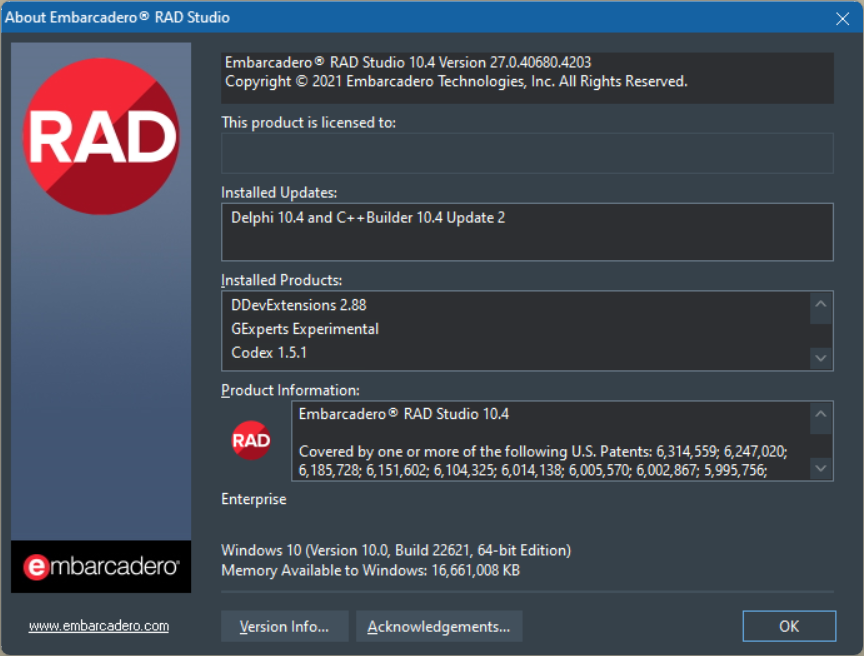
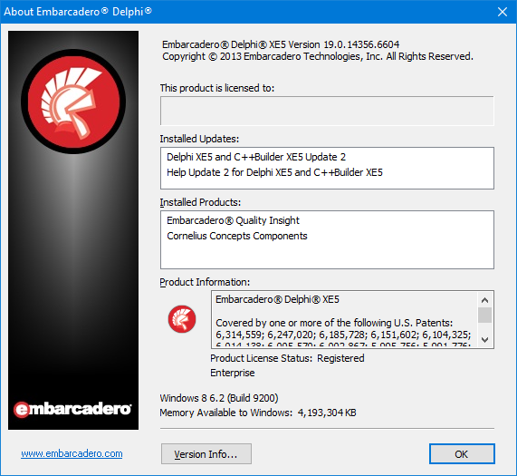
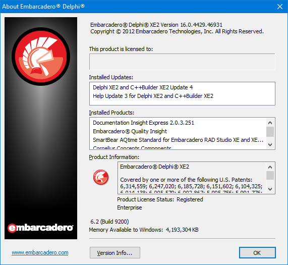
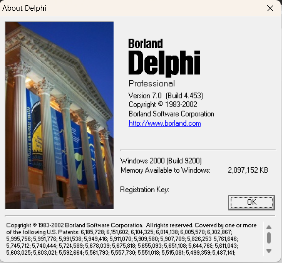

# Unofficial list of Delphi About Screens

- Delphi 10.3
- Delphi 10.2

- Delphi 10

- Delphi 2010
- Delphi 2009
- Delphi 2007
- Delphi 2006

- Delphi 6
- Delphi 5

You can read about the history of the Borland/Embarcadero Delphi product line on [Wikipedia](https://en.wikipedia.org/wiki/History_of_Delphi_(software)).